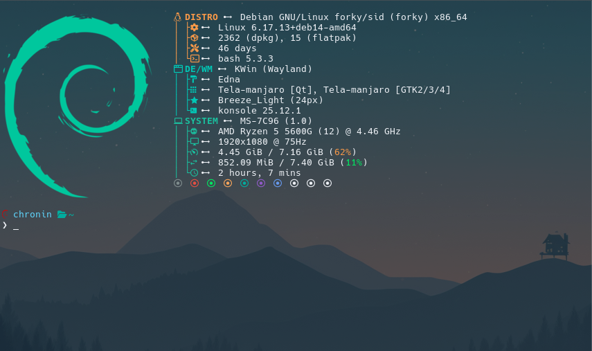

# 🚀 Custom Fastfetch & Bash Aesthetic Setup

A cross-distro automation script to beautify your terminal with a custom PNG logo, transparent background, and a sleek Bash prompt. Optimized for **KDE Konsole** and modern terminal emulators.



## ✨ Features
- **Smart Detection**: Identifies your distro (Arch, Ubuntu, Fedora) and terminal capabilities.
- **PNG Logo Support**: Automatically configures Fastfetch to render high-res images.
- **Modern Prompt**: A customized `PS1` with vibrant colors.
- **Safe Setup**: Automatically backups your existing `.bashrc` and `fastfetch` configs.
- **Transparency**: Auto-configures Konsole profiles for that 90% opacity look.

## 🛠️ One-Line Installation

Open your terminal and paste the following:

```bash
curl -sSL https://raw.githubusercontent.com/ChroninOS/Fetch.git | bash